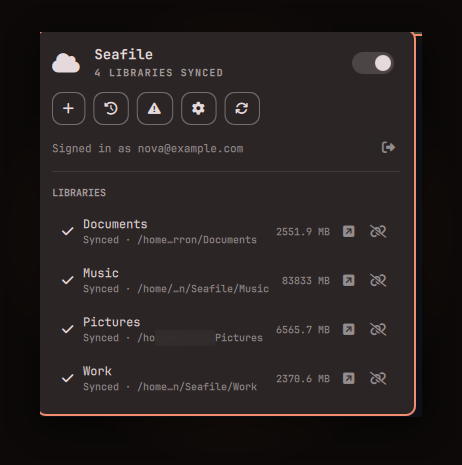

# Seafile

A Seafile sync client for the Omarchy bar, built entirely on top of
[`seaf-cli`](https://help.seafile.com/syncing_client/seaf-cli/) — no GUI
client (`seafile-applet`) required. Covers everything that GUI normally
does: account login, browsing and adding libraries, sync status, and an
activity feed, plus desktop notifications when files change — and goes a
bit further with account-wide search, share links, and trash recovery.



## Features

- **Status icon** that reflects real sync state: a spinning icon while
  anything is uploading/downloading/indexing, a warning triangle on a sync
  error, plain otherwise. Right-click to refresh, middle-click to
  start/stop the daemon.
- **Library list** with per-library status, path, live transfer rate and
  sync progress (%) while busy, and a one-click desync (unlinks without
  touching local files).
- **Storage quota** — usage and total, shown under your signed-in account.
- **Standalone login** — its own account-token exchange with the server,
  independent of the GUI client. If `seafile-applet` happens to be logged
  in already, its account is imported automatically as a convenience, but
  this plugin never depends on it being installed.
- **Add libraries**: browse everything on the server (with size, an
  encrypted-library indicator, and a read-only badge for libraries shared
  without write access), download a fresh copy to a new folder, or link an
  existing local folder — all inline in the bar popup, with shell-style Tab
  path completion instead of a file-picker dialog (opening one would steal
  focus and close the popup).
- **Create a library** on the server, encrypted or not.
- **Share links** — one click copies a Seahub share link for a library
  (local or remote) to the clipboard.
- **Trash** — per-library recently-deleted files and folders, with a
  Restore button, sourced from Seahub's trash API.
- **Search** — account-wide file search across every library on the
  server. Requires Seafile Professional with a search backend configured;
  a Community Edition server reports search as unavailable rather than
  failing silently. A result already synced locally can be opened directly
  on disk, not just in Seahub.
- **Activity feed** — recent file changes across your libraries, pulled
  from each library's commit history, with a link straight to that
  library in Seahub.
- **Desktop notifications** for libraries finishing a sync, sync errors,
  individual file adds/modifications/deletes, and completed
  downloads/links/creates. Can be muted entirely in the widget's settings
  (the bar's own plugin-settings dialog, not the in-popup Settings view).
- **Sync error detail** — which file failed and why, per library, sourced
  from the local RPC client (`seaf-cli status` only reports a library-level
  "error" state). Conflicts (both versions of a file exist locally to
  review) are shown separately from genuine errors, since nothing is
  actually broken. Dismiss individual errors once resolved.
- **Settings**: device name (shown in the server's linked-devices list),
  upload/download bandwidth limits (KB/s), ignore-symlinks, a
  delete-confirmation threshold, and HTTP/SOCKS proxy configuration — all
  daemon-level settings the desktop client exposes that no `seaf-cli`
  subcommand covers, set through the same local RPC client. The proxy
  password is never read back into the widget once set — only whether one
  is configured.
- **Per-library size**, calculated on demand (a button per row, not
  automatic — walking a large library's files takes a moment).
- **Open in Seahub** — a link per library (local or remote) to that
  library's web file browser, for history/sharing/permissions, which are
  deliberately out of scope for this widget itself.
- **Keyboard navigation** — arrow keys move a highlighted selection through
  the library list and search results, Enter/Space activates it, same as
  the rest of the Omarchy bar's popups.

## Requirements

- [Omarchy](https://omarchy.org/) with the Quickshell-based bar.
- `seaf-cli` (the Seafile command-line client) installed and initialized
  (`seaf-cli init`), with `seaf-daemon` able to run.
- `python3` with the `seafile` RPC module (installed alongside `seaf-cli`
  as a dependency) — used for the local parts of downloading/linking a
  library, and `sqlite3`/`configparser` from the standard library.
- `wl-copy` (from `wl-clipboard`) for the "Copy share link" action, and
  `xdg-open` (from `xdg-utils`) for opening a search result or a library
  locally — both are standard on a Wayland/Omarchy desktop already.

### Installing seaf-cli on Arch / Omarchy

`seaf-cli` isn't in the official Arch repos — it comes from the
[`seafile`](https://aur.archlinux.org/packages/seafile) AUR package (it
provides `seafile-client-cli`, i.e. `seaf-cli`, and conflicts with
`seafile-server`, so don't install both):

```sh
omarchy pkg aur add seafile
```

Or with `yay`/any AUR helper directly:

```sh
yay -S seafile
```

Then initialize it once, pointing at wherever you want libraries to sync
to by default:

```sh
seaf-cli init -d ~/Seafile
seaf-cli start
```

The plugin picks up from there — open the bar icon and use "Log in" to
connect to your server.

## Why not just call `seaf-cli` for everything?

`seaf-cli`'s own `list-remote`/`download`/`sync`/`create` subcommands make
their HTTP requests with Python's default `urllib` User-Agent. Servers
behind a hardened reverse proxy or WAF (Cloudflare, etc.) commonly block
that outright, which surfaces as opaque failures with nothing to do with
your actual Seafile account (in one case, literally a bare `error code:
1010` — a Cloudflare bot-block code, not a Seafile error). This plugin
reimplements those four operations itself with a normal User-Agent header,
using the same local `seafile` RPC socket `seaf-cli` uses for the parts
that don't touch the network. Local-only operations (`list`, `status`,
`start`, `stop`, `desync`) go straight through plain `seaf-cli`, since
those never hit the network in the first place.

## Install

```sh
omarchy plugin add https://github.com/kerrongordon/omarchy-plugin-seafile.git --enable
```

## Usage

Click the bar icon to see your synced libraries. From there:

- **Add library** — log in (first time) or browse the server's libraries
  and download/link one.
- **Search** — account-wide file search (requires Seafile Professional).
- **Activity** — recent file changes across your libraries.
- **Errors** — per-file sync error and conflict detail, with a count badge
  when any exist.
- **Settings** — bandwidth limits, sync behavior, and proxy configuration.
- The small icons on each library row calculate its size, copy a share
  link, open its trash, and desync it (local files are kept on desync).
- Arrow keys move a highlighted selection through the library list or
  search results; Enter/Space opens the selected one.
- The toggle switch in the header starts/stops the Seafile daemon. Once an
  account is linked, the daemon also auto-starts the first time the widget
  loads each session (e.g. at login) so syncing resumes without a manual
  click, same as the desktop client.

## Configure

```sh
omarchy bar move io.github.kerrongordon.seafile --section right
```

The refresh interval (how often local status, account state, and activity
are polled) is configurable from the plugin's settings in the bar
configuration UI, or directly in `~/.config/omarchy/shell.json`:

```json
{ "id": "io.github.kerrongordon.seafile", "refreshIntervalSec": 30 }
```

## Security notes

- Your account server/username/token are stored in
  `~/.local/state/omarchy-seafile/account.ini`, mode `0600`. Your password
  is never written to disk — it's used once, over the login process's
  stdin (never a command-line argument), to fetch the token.
- That file is written through a symlink-safe, atomic path: every directory
  component is opened with `O_NOFOLLOW`, an existing target that isn't a
  plain file is refused, and the new content lands via a `0600` temp file in
  the same held directory, `fsync`'d and renamed into place.
- Deliberately stored outside the plugin's own directory: Omarchy hot-reloads
  a plugin whenever a file under its directory changes, and a file this
  plugin itself rewrites periodically would otherwise trigger an infinite
  reload loop.
- Login and the remote-library API calls require `https://` (an `http://`
  exception exists only for `localhost`, for local test servers), reject
  URLs with embedded credentials, and only follow same-origin redirects, up
  to a small cap.
- The daemon's stored proxy password is never read back into this process —
  the settings panel only shows whether one is configured, and a new value
  is sent over the same local RPC socket without ever displaying the old one.

## Uninstall

```sh
omarchy plugin remove io.github.kerrongordon.seafile
```

This does not touch your Seafile libraries or their local files, and does
not stop `seaf-daemon` if it's running — only the bar widget goes away.
Delete `~/.local/state/omarchy-seafile/` if you also want the stored
account removed.

## Development

`Model.js` and the Python embedded in `Service.qml` (account handling,
every Seahub API call, every seaf-daemon RPC call) have a test suite —
no dependencies to install beyond Node and Python 3. See
[tests/README.md](tests/README.md) or just run:

```sh
tests/run.sh
```

## License

MIT — see [LICENSE](LICENSE).

`icons/seafile.png` is from [selfh.st/icons](https://github.com/selfhst/icons)
(via [dashboardicons.com](https://dashboardicons.com/icons/external/seafile)),
licensed [CC BY 4.0](https://creativecommons.org/licenses/by/4.0/).
